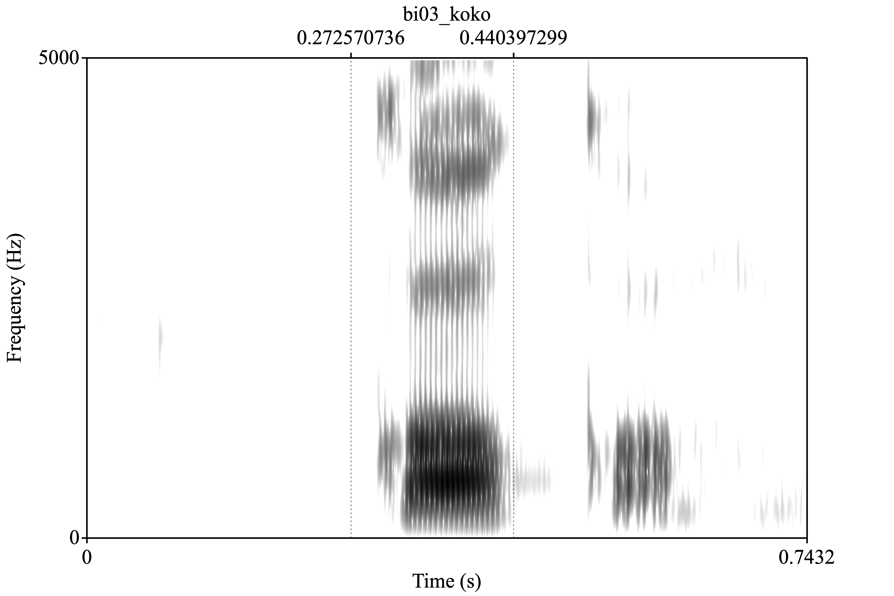

**Author**: Maricruz Azcona-Parajon  
**Date**: Last update: `r Sys.time()`

# Overview

For this assignment, I analyze productions of Spanish-like nonce words produced by bilingual speakers and L2 learners. The targets are paroxytones with voiceless stops and all five Spanish oral vowels.

**Hypothesis.** Because these recordings are productions of Spanish-like nonce words containing voiceless stops and all five Spanish oral vowels, bilingual speakers will produce more target-like Spanish segmental patterns than the L2 learners. Specifically, bilinguals are expected to show shorter, more consistent VOT values for /p t k/ and clearer, more peripheral vowel formant patterns in F1–F2 space. In contrast, L2 learners are expected to produce longer, more English-like VOTs and more centralized, less distinct vowel qualities, with greater variability across repetitions. The vowels for each speaker should reflect that speaker's dominant language. Overall, the acoustic measures of VOT and formants should reveal more native-like stability in the bilinguals and more L1-influenced variability in the L2 learners.

# Prep

## Libraries

```{r load-libs, echo=FALSE, warning=FALSE, message=FALSE}
# Load libraries here
library(tidyverse)
library(knitr)

# Optional: install here package if you don't have it
# install.packages("here")
# library(here)
```

## Load data

```{r load-data, message=FALSE, warning=FALSE}
# Print current working directory
print(paste("Current working directory:", getwd()))

# Check if data folder exists
if(!dir.exists("data")) {
  stop("The 'data' folder does not exist in the current directory. 
       Make sure your .Rmd file is in the pa_4 folder.")
}

# Get all CSV files from the data directory
data_files <- list.files(path = "data", 
                         pattern = "\\.csv$", 
                         full.names = TRUE)

# Check if files were found
if(length(data_files) == 0) {
  # Try to see what IS in the data folder
  all_files <- list.files("data")
  print("Files in data folder:")
  print(all_files)
  stop("No CSV files found in data directory")
}

print(paste("Found", length(data_files), "files"))
print(data_files)

# Read each file and add filename column
data_list <- list()
for(i in seq_along(data_files)) {
  temp_data <- read_csv(data_files[i], show_col_types = FALSE)
  temp_data$filename <- basename(data_files[i])
  data_list[[i]] <- temp_data
}

# Combine all data
my_data <- bind_rows(data_list)

# View the structure to see what columns we have
print("Column names:")
print(colnames(my_data))
glimpse(my_data)
```

## Tidy data

```{r tidy-data}
# Check if filename column exists
if(!"filename" %in% colnames(my_data)) {
  stop("Error: filename column not found. Check the load-data chunk.")
}

# Create a participant group variable based on filename
# bi = bilingual, ne = L2 learner
my_data <- my_data %>%
  mutate(
    group = case_when(
      str_detect(filename, "^bi") ~ "Bilingual",
      str_detect(filename, "^ne") ~ "L2_Learner",
      TRUE ~ NA_character_
    ),
    participant = str_extract(filename, "^[a-z]{2}\\d{2}"),
    # Rename 'notes' to 'vowel' for clarity
    vowel = notes
  )

# Check the result
table(my_data$group)
table(my_data$participant)
table(my_data$vowel)

# View summary
glimpse(my_data)
```

# Analysis

## Descriptives

```{r descriptive-stats}
# VOT descriptive statistics by group
vot_stats <- my_data %>%
  group_by(group) %>%
  summarise(
    n = n(),
    mean_vot = mean(vot, na.rm = TRUE),
    sd_vot = sd(vot, na.rm = TRUE),
    min_vot = min(vot, na.rm = TRUE),
    max_vot = max(vot, na.rm = TRUE)
  )

kable(vot_stats, 
      digits = 2,
      caption = "VOT Descriptive Statistics by Speaker Group")

# Check if we have vowel data
if(sum(!is.na(my_data$vowel) & my_data$vowel != "") > 0) {
  
  # Filter clean data for formant analysis
  my_data_clean <- my_data %>%
    filter(!is.na(vowel), vowel != "", !is.na(f1), !is.na(f2))
  
  # Formant descriptive statistics by group and vowel
  formant_stats <- my_data_clean %>%
    group_by(group, vowel) %>%
    summarise(
      n = n(),
      mean_f1 = mean(f1, na.rm = TRUE),
      sd_f1 = sd(f1, na.rm = TRUE),
      mean_f2 = mean(f2, na.rm = TRUE),
      sd_f2 = sd(f2, na.rm = TRUE),
      .groups = "drop"
    )
  
  kable(formant_stats, 
        digits = 2,
        caption = "Formant Descriptive Statistics by Group and Vowel")
} else {
  print("No vowel labels found. Check your TextGrid files.")
}
```

## Visualization

```{r plots, fig.retina=2}
# VOT by group
ggplot(my_data, aes(x = group, y = vot, fill = group)) +
  geom_boxplot(alpha = 0.7) +
  geom_jitter(width = 0.2, alpha = 0.3) +
  theme_minimal() +
  labs(title = "VOT Distribution by Speaker Group",
       x = "Speaker Group",
       y = "VOT (ms)") +
  theme(legend.position = "none")

# Only create vowel plots if we have vowel data
if(sum(!is.na(my_data$vowel) & my_data$vowel != "") > 0) {
  
  # Filter clean data
  my_data_clean <- my_data %>%
    filter(!is.na(vowel), vowel != "", !is.na(f1), !is.na(f2))
  
  # Vowel space plot (F1 vs F2) with vowel labels
  print(ggplot(my_data_clean, aes(x = f2, y = f1, color = vowel, shape = group)) +
    geom_point(size = 3, alpha = 0.6) +
    geom_text(aes(label = vowel), hjust = -0.3, vjust = 0.3, 
              size = 3, show.legend = FALSE) +
    scale_x_reverse() +
    scale_y_reverse() +
    theme_minimal() +
    labs(title = "Vowel Space: F1 vs F2 by Group",
         x = "F2 (Hz)",
         y = "F1 (Hz)",
         color = "Vowel",
         shape = "Group"))
  
  # Mean vowel positions with labels (cleaner visualization)
  vowel_means <- my_data_clean %>%
    group_by(group, vowel) %>%
    summarise(
      mean_f1 = mean(f1, na.rm = TRUE),
      mean_f2 = mean(f2, na.rm = TRUE),
      .groups = "drop"
    )
  
  print(ggplot(vowel_means, aes(x = mean_f2, y = mean_f1, color = vowel, shape = group)) +
    geom_point(size = 5, alpha = 0.8) +
    geom_text(aes(label = vowel), hjust = -0.3, vjust = 0.3, 
              size = 5, fontface = "bold", show.legend = FALSE) +
    scale_x_reverse() +
    scale_y_reverse() +
    theme_minimal() +
    labs(title = "Mean Vowel Space by Group",
         x = "F2 (Hz)",
         y = "F1 (Hz)",
         color = "Vowel",
         shape = "Group") +
    theme(legend.position = "right"))
  
} else {
  print("No vowel data available for vowel space plots.")
}
```

<!-- Praat figure example -->

**Figure 1**: Example acoustic analysis from Praat

```{r praat-figure, echo=FALSE, out.width="80%", fig.align="center"}
# Include Praat-generated figure using relative path
# Assumes image is in 'figs' or 'figures' folder


# Alternative paths depending on your project structure:
# knitr::include_graphics("figures/praat_analysis.png")
# knitr::include_graphics("images/acoustic_plot.png")
```

## Hypothesis test

```{r stats}
# Test for VOT differences between groups
vot_model <- lm(vot ~ group, data = my_data)
summary(vot_model)

# Alternative: t-test for VOT
# vot_test <- t.test(vot ~ group, data = my_data)
# print(vot_test)

# Check vowel data
print("Checking vowel data:")
print(table(my_data$vowel, useNA = "always"))
print(paste("Number of unique vowels:", length(unique(my_data$vowel[!is.na(my_data$vowel)]))))

# Try to run formant models with error handling
tryCatch({
  
  # Check if vowel column exists and has data
  if("vowel" %in% colnames(my_data)) {
    
    # Filter out missing or empty vowels
    my_data_clean <- my_data %>%
      filter(!is.na(vowel), !is.na(f1), !is.na(f2), vowel != "")
    
    print(paste("Rows in cleaned data:", nrow(my_data_clean)))
    print(paste("Unique vowels in cleaned data:", paste(unique(my_data_clean$vowel), collapse=", ")))
    print(paste("Number of unique vowels:", length(unique(my_data_clean$vowel))))
    
    # Need at least 2 different vowels for the model
    if(nrow(my_data_clean) > 10 && length(unique(my_data_clean$vowel)) >= 2) {
      
      # Test for formant differences (F1)
      print("Running F1 model...")
      f1_model <- lm(f1 ~ group * vowel, data = my_data_clean)
      print(summary(f1_model))
      
      # Test for formant differences (F2)
      print("Running F2 model...")
      f2_model <- lm(f2 ~ group * vowel, data = my_data_clean)
      print(summary(f2_model))
      
    } else if(length(unique(my_data_clean$vowel)) < 2) {
      print(paste("ERROR: Only", length(unique(my_data_clean$vowel)), "unique vowel found."))
      print("You need at least 2 different vowels to run the vowel analysis.")
      print("This means your TextGrid files don't have vowel labels on tier 4.")
      print("Please add vowel labels (a, e, i, o, u) to tier 4 in Praat and re-extract the data.")
    } else {
      print("Not enough data rows for analysis.")
    }
    
  } else {
    print("Vowel column not found.")
  }
  
}, error = function(e) {
  print(paste("Error in formant analysis:", e$message))
  print("Your TextGrid files likely don't have vowel labels.")
  print("Add vowel labels to tier 4 in Praat, then re-run the Praat script.")
})
```

# Conclusion

<!-- 
Revisit your hypotheses (refer to plots, figures, tables, statistical tests, 
etc.)
Reflect on the entire process. 
What did you enjoy? What did you hate? What did you learn? 
What would you do differently?
-->
Overall, the results partially supported the hypothesis that bilingual speakers would produce more target-like Spanish patterns than L2 learners, with bilinguals generally showing shorter and more consistent VOT values and clearer vowel spaces. L2 learners showed greater variability and, in some cases, more English-like patterns in both VOT and vowel quality. This project was more challenging than expected due to repeated coding errors, issues with the vowel data, and the need to rely on ChatGPT and google to help with R. However, despite the frustration, and many hours of segmentation and having to walk away from my computer, the experience highlighted how much real research involves troubleshooting and taught me the importance of just pushing through and learning from my mistakes ( I deleted my code like 6 times.)
</br></br>
