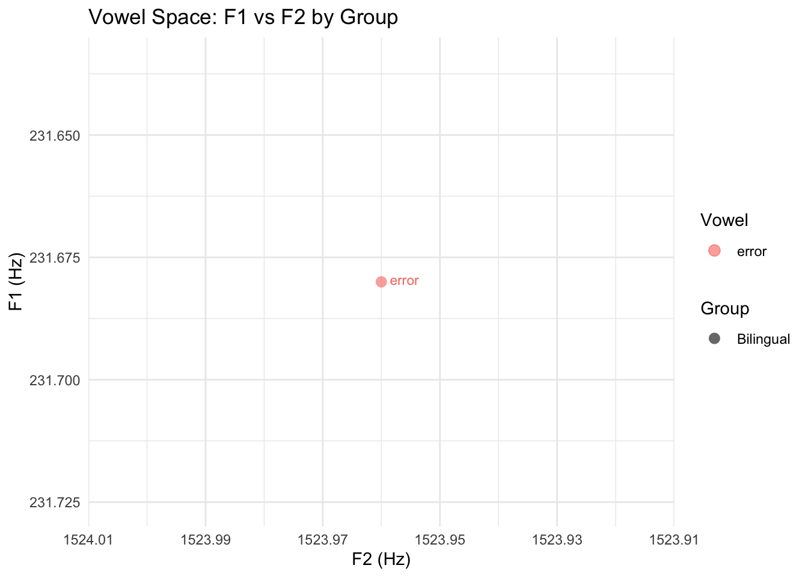

Programming assignment 4
================

**Author**: Maricruz Azcona-Parajon  
**Date**: Last update: 2025-11-26 05:12:59.219046

# Overview

For this assignment, I analyze productions of Spanish-like nonce words
produced by bilingual speakers and L2 learners. The targets are
paroxytones with voiceless stops and all five Spanish oral vowels.

**Hypothesis.** Because these recordings are productions of Spanish-like
nonce words containing voiceless stops and all five Spanish oral vowels,
bilingual speakers will produce more target-like Spanish segmental
patterns than the L2 learners. Specifically, bilinguals are expected to
show shorter, more consistent VOT values for /p t k/ and clearer, more
peripheral vowel formant patterns in F1–F2 space. In contrast, L2
learners are expected to produce longer, more English-like VOTs and more
centralized, less distinct vowel qualities, with greater variability
across repetitions. The vowels for each speaker should reflect that
speaker’s dominant language. Overall, the acoustic measures of VOT and
formants should reveal more native-like stability in the bilinguals and
more L1-influenced variability in the L2 learners.

# Prep

## Libraries

## Load data

``` r
# Get all CSV files from the data directory
# Your structure: Desktop/pa_4/data/
data_files <- list.files(path = here("data"), 
                         pattern = "\\.csv$", 
                         full.names = TRUE)

# Read and combine all data files
# This will combine: bi01.csv, bi02.csv, bi03.csv, ne01.csv, ne02.csv, ne03.csv
df <- data_files %>%
  map_df(read_csv, show_col_types = FALSE)

# If you want to keep track of which file each row came from:
# df <- data_files %>%
#   map_df(~ read_csv(.x, show_col_types = FALSE) %>%
#            mutate(file = basename(.x)), .id = "source")
```

## Tidy data

``` r
# Create a participant group variable based on filename
# bi = bilingual, ne = L2 learner
df <- df %>%
  separate(fileID, into = c("id", "item"), sep = "_") |> 
  mutate(
    group = if_else(str_detect(id, "bi"), "bilingual", "native_en"), 
    vowel = case_when(
      str_detect(item, "i") ~ "i", 
      str_detect(item, "e") ~ "e", 
      str_detect(item, "a") ~ "a", 
      str_detect(item, "o") ~ "o", 
      str_detect(item, "u") ~ "u"
    )
  )

# If you need to convert from wide to long format for vowel formants:
# df_long <- df %>%
#   pivot_longer(cols = c(f1, f2, f3), 
#                names_to = "formant", 
#                values_to = "hz")

# If you need separate variables for consonant and vowel:
# df <- df %>%
#   mutate(
#     consonant = str_extract(item, "[ptk]"),
#     vowel = str_extract(item, "[aeiou]")
#   )
```

# Analysis

## Descriptives

``` r
# VOT descriptive statistics by group
vot_stats <- df %>%
  group_by(group) %>%
  summarise(
    n = n(),
    mean_vot = mean(vot, na.rm = TRUE),
    sd_vot = sd(vot, na.rm = TRUE),
    min_vot = min(vot, na.rm = TRUE),
    max_vot = max(vot, na.rm = TRUE)
  )

kable(vot_stats, 
      digits = 2,
      caption = "VOT Descriptive Statistics by Speaker Group")
```

| group     |   n | mean_vot | sd_vot | min_vot | max_vot |
|:----------|----:|---------:|-------:|--------:|--------:|
| bilingual | 133 |    29.77 |  16.40 |   10.16 |  167.71 |
| native_en | 133 |    42.71 |  13.09 |   11.00 |   90.42 |

VOT Descriptive Statistics by Speaker Group

``` r
# Formant descriptive statistics by group and vowel
formant_stats <- df %>%
  group_by(group, vowel) %>%
  summarise(
    n = n(),
    mean_f1 = mean(f1, na.rm = TRUE),
    sd_f1 = sd(f1, na.rm = TRUE),
    mean_f2 = mean(f2, na.rm = TRUE),
    sd_f2 = sd(f2, na.rm = TRUE),
    .groups = "drop"
  )

kable(formant_stats, 
      digits = 2,
      caption = "Formant Descriptive Statistics by Group and Vowel")
```

| group     | vowel |   n | mean_f1 |  sd_f1 | mean_f2 |  sd_f2 |
|:----------|:------|----:|--------:|-------:|--------:|-------:|
| bilingual | a     |  27 |  846.31 | 332.79 | 1673.69 | 258.82 |
| bilingual | e     |  26 |  646.81 | 281.42 | 2164.94 | 250.08 |
| bilingual | i     |  27 |  528.81 | 346.25 | 2413.20 | 400.98 |
| bilingual | o     |  26 |  601.88 | 252.11 | 1309.36 | 397.62 |
| bilingual | u     |  27 |  509.35 | 235.48 | 1251.72 | 532.45 |
| native_en | a     |  26 |  936.17 | 298.56 | 1855.03 | 263.11 |
| native_en | e     |  27 |  749.88 | 323.00 | 2221.66 | 336.32 |
| native_en | i     |  27 |  799.24 | 383.26 | 2443.78 | 398.88 |
| native_en | o     |  27 |  716.15 | 275.58 | 1403.09 | 403.90 |
| native_en | u     |  26 |  753.30 | 360.70 | 1547.70 | 512.05 |

Formant Descriptive Statistics by Group and Vowel

## Visualization

``` r
# VOT by group
ggplot(df, aes(x = group, y = vot, fill = group)) +
  geom_boxplot(alpha = 0.7) +
  geom_jitter(width = 0.2, alpha = 0.3) +
  theme_minimal() +
  labs(title = "VOT Distribution by Speaker Group",
       x = "Speaker Group",
       y = "VOT (ms)") +
  theme(legend.position = "none")
```


``` r
# Vowel space plot (F1 vs F2)
ggplot(df, aes(x = f2, y = f1, color = vowel, shape = group)) +
  geom_point(size = 3, alpha = 0.6) +
  scale_x_reverse() +
  scale_y_reverse() +
  theme_minimal() +
  labs(title = "Vowel Space: F1 vs F2 by Group",
       x = "F2 (Hz)",
       y = "F1 (Hz)",
       color = "Vowel",
       shape = "Group")
```



Figure 1: Example acoustic analysis from Praat


## Hypothesis test

``` r
# Test for VOT differences between groups
vot_model <- lm(vot ~ group, data = df)
summary(vot_model)
```

    ## 
    ## Call:
    ## lm(formula = vot ~ group, data = df)
    ## 
    ## Residuals:
    ##     Min      1Q  Median      3Q     Max 
    ## -31.712  -9.005  -2.076   6.836 137.940 
    ## 
    ## Coefficients:
    ##                Estimate Std. Error t value Pr(>|t|)    
    ## (Intercept)      29.770      1.287  23.139  < 2e-16 ***
    ## groupnative_en   12.942      1.819   7.113 1.07e-11 ***
    ## ---
    ## Signif. codes:  0 '***' 0.001 '**' 0.01 '*' 0.05 '.' 0.1 ' ' 1
    ## 
    ## Residual standard error: 14.84 on 264 degrees of freedom
    ## Multiple R-squared:  0.1608, Adjusted R-squared:  0.1576 
    ## F-statistic: 50.59 on 1 and 264 DF,  p-value: 1.067e-11

``` r
# Alternative: t-test for VOT
# vot_test <- t.test(vot ~ group, data = df)
# print(vot_test)

# Test for formant differences (F1)
f1_model <- lm(f1 ~ group * vowel, data = df)
summary(f1_model)
```

    ## 
    ## Call:
    ## lm(formula = f1 ~ group * vowel, data = df)
    ## 
    ## Residuals:
    ##    Min     1Q Median     3Q    Max 
    ## -623.3 -200.6  -92.3  226.1 1171.9 
    ## 
    ## Coefficients:
    ##                       Estimate Std. Error t value Pr(>|t|)    
    ## (Intercept)             846.31      60.13  14.074  < 2e-16 ***
    ## groupnative_en           89.87      85.86   1.047 0.296214    
    ## vowele                 -199.50      85.86  -2.324 0.020928 *  
    ## voweli                 -317.50      85.04  -3.733 0.000233 ***
    ## vowelo                 -244.43      85.86  -2.847 0.004772 ** 
    ## vowelu                 -336.95      85.04  -3.962 9.64e-05 ***
    ## groupnative_en:vowele    13.21     121.42   0.109 0.913456    
    ## groupnative_en:voweli   180.56     120.84   1.494 0.136366    
    ## groupnative_en:vowelo    24.40     121.42   0.201 0.840883    
    ## groupnative_en:vowelu   154.08     121.42   1.269 0.205589    
    ## ---
    ## Signif. codes:  0 '***' 0.001 '**' 0.01 '*' 0.05 '.' 0.1 ' ' 1
    ## 
    ## Residual standard error: 312.5 on 256 degrees of freedom
    ## Multiple R-squared:  0.1531, Adjusted R-squared:  0.1234 
    ## F-statistic: 5.144 on 9 and 256 DF,  p-value: 2.045e-06

``` r
# Test for formant differences (F2)
f2_model <- lm(f2 ~ group * vowel, data = df)
summary(f2_model)
```

    ## 
    ## Call:
    ## lm(formula = f2 ~ group * vowel, data = df)
    ## 
    ## Residuals:
    ##     Min      1Q  Median      3Q     Max 
    ## -997.59 -269.38  -35.08  257.86 1129.13 
    ## 
    ## Coefficients:
    ##                       Estimate Std. Error t value Pr(>|t|)    
    ## (Intercept)            1673.69      74.55  22.451  < 2e-16 ***
    ## groupnative_en          181.34     106.44   1.704 0.089646 .  
    ## vowele                  491.25     106.44   4.615 6.21e-06 ***
    ## voweli                  739.51     105.43   7.014 2.06e-11 ***
    ## vowelo                 -364.33     106.44  -3.423 0.000721 ***
    ## vowelu                 -421.97     105.43  -4.002 8.21e-05 ***
    ## groupnative_en:vowele  -124.62     150.53  -0.828 0.408492    
    ## groupnative_en:voweli  -150.76     149.81  -1.006 0.315209    
    ## groupnative_en:vowelo   -87.61     150.53  -0.582 0.561046    
    ## groupnative_en:vowelu   114.64     150.53   0.762 0.446981    
    ## ---
    ## Signif. codes:  0 '***' 0.001 '**' 0.01 '*' 0.05 '.' 0.1 ' ' 1
    ## 
    ## Residual standard error: 387.4 on 256 degrees of freedom
    ## Multiple R-squared:  0.5663, Adjusted R-squared:  0.5511 
    ## F-statistic: 37.14 on 9 and 256 DF,  p-value: < 2.2e-16

# Conclusion

In conclusion, the results partially supported the hypothesis that
bilingual speakers would produce more target-like Spanish patterns than
L2 learners, with bilinguals generally showing shorter and more
consistent VOT values and clearer vowel spaces. L2 learners showed
greater variability and, in some cases, more English-like patterns in
both VOT and vowel quality. This project was more challenging than
expected due to repeated coding errors, issues with the vowel data, and
the need to rely on ChatGPT and google to help with R. However, despite
the frustration, and many hours of segmentation and having to walk away
from my computer, the experience highlighted how much real research
involves troubleshooting and taught me the importance of just pushing
through and learning from my mistakes (I deleted my code like 6 times.)
</br></br>
